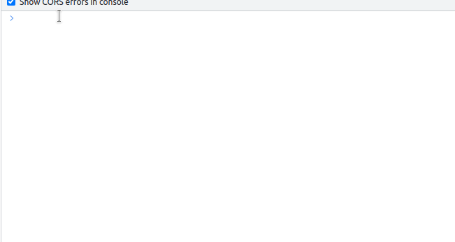
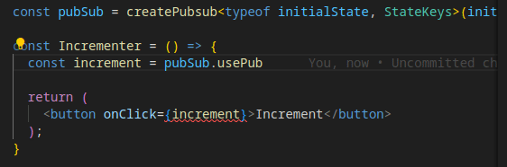

# Motivation
State management in React as easy as possible

# Installation
```bash
yarn add rxjs pubsub-hooks
```
:warning: `pubsub-hooks` references `react` and `rxjs` as peer dependencies. Make sure you installed them in you app

# Demo
https://antonshanyuk.github.io/pubsub-hooks/?path=/story/pubsub-example--pub-sub

# Usage
### Create pubSub instance which will be shared accross the app
```tsx
// pubSub.ts

import { createPubsub } from 'pubsub-hooks';

export default createPubsub({ counter: 0 });
```
### Subscribe for updates
```tsx
//subscriberComponent.tsx

const SubscriberComponent = () => {
  const counter = pubSub.useSub('counter');

  return (
    <div>{counter}</div>
  );
}
```
### Push the updates
```tsx
//updateComponent.tsx 

import pubSub from './pubSub.ts';

const UpdateComponent = () => {
  // If you need to set a static value
  const staticUpdate = pubSub.usePub('counter', () => 42);

  // If you need an existing value for the update
  const increment = pubSub.usePub('counter', x => x + 1);

  // Only pass the key if the event sets value directly
  // this equals to pubSub.usePub('counter', x => x);
  const updateFromChild = pubSub.usePub('counter')

  return (
    <>
      <button onClick={staticUpdate}>Set 42</button>
      <button onClick={increment}>Increment</button>
      <button onClick={() => {
        update(false);
      }}>Set 34</button>
    </>
  );
}

```
# Caveats
If you use `React.memo` for you components - make sure to wrap `usePub` callbacks into `React.useCallback`, especially if you use variables from the outer scope:
```ts
const [variable, setVariable] = React.useState(0);

...

const increment = pubSub.usePub('counter',
  React.useCallback(() => variable, [variable]));
```
# Debugging

When creating a pubSub instance for your app you may want to have a possibility to check the state of your app. You may achive that by defining a global variable and passing it as an optional argument of `createPubsub`:

```ts
import { createPubsub, SubjectsStorage } from 'pubsub-hooks';

const initialState = { counter: 0 };

// extending window interface
declare global {
  interface Window {
    pubsub: Record<string, SubjectsStorage<typeof initialState>>;
  }
}

window.pubsub = {};

const pubSub = createPubsub<typeof initialState>(initialState, window.pubsub);
```

This way you will have the possibility to check the value in the console:
```ts
console.log(window.pubsub.counter.getValue());
```


Or subscribe for the updates:
```ts
window.pubsub.counter.subscribe((value) =>
  console.log('updated value', value))
```


# Types and intellisense
## Naming conflicts
To ensure you dont have naming conflicts in your store, you may explicitly set enum for the storage keys:

```ts
const initialState = { counter: 0, showCounter: false };
enum StateKeys {
  Counter = 'counter',
  ShowCounter = 'showCounter',
};

const pubSub = createPubsub<typeof initialState, StateKeys>(initialState);
```
This way you'll be forced to use this enum everywhere in your app:

# Explicit type for the storage
You may also pass the type for the storage explicitly instead of using `typeof initialState`:

```ts
const initialState = {};
enum StateKeys {
  Counter = 'counter',
};
type State = {
  counter?: number;
};

const pubSub = createPubsub<State, StateKeys>(initialState);
```
